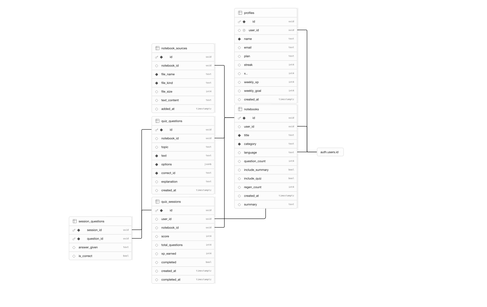

# StudyRush ⚡

> הפוך את הלמידה שלך למשחק — Turn your learning into a game.

**🔗 אתר חי:** [study-rush-theta.vercel.app](https://study-rush-theta.vercel.app)
**📦 GitHub:** [github.com/Noam2058/StudyRush](https://github.com/Noam2058/StudyRush)

---

## 📋 סקירה כללית

StudyRush היא אפליקציית למידה מבוססת AI בסגנון Duolingo: המשתמש מעלה חומר לימוד (PDF, Word, PowerPoint, טקסט), וה-AI בונה ממנו תוך שניות חידון אינטראקטיבי וסיכום אישי. האפליקציה משלבת מערכת XP, סטריקים יומיים ולוח מובילים כדי להפוך חזרה על חומר לחוויה מערכת ומתמשכת.

## 🎯 הבעיה שהפרויקט פותר

סטודנטים ותלמידי תיכון מקבלים כל שבוע כמויות גדולות של חומר לימוד — מצגות, סיכומים, PDFs — וההכנה לבחינות דורשת מהם לעבד את החומר הזה לשאלות תרגול בעצמם. זה תהליך איטי, משעמם, ולרוב נדחה לרגע האחרון. StudyRush מקצר את הפער בין "יש לי PDF של 40 שקפים" ל"יש לי חידון תרגול מוכן" מכמה שעות לכמה שניות.

## 👥 קהל היעד

תלמידי תיכון וסטודנטים (בעיקר בתואר ראשון) שמתכוננים למבחנים ורגילים לקבל חומר בפורמטים שונים (מצגות מהמרצה, PDF סרוקים, סיכומים בוורד) ורוצים שיטת חזרה אינטראקטיבית במקום קריאה פסיבית חזרה ושוב.

## 🥊 מתחרים ובידול

| פתרון קיים | החיסרון |
|---|---|
| **קריאה חזרה על הסיכום** | פסיבי, לא בודק הבנה, משעמם |
| **Quizlet / Anki** | דורש להקליד את הכרטיסיות ידנית — עבודה ידנית כבדה |
| **ChatGPT ישירות** | אין מעקב התקדמות, אין סטריק, אין תחושת "משחק", לא שומר היסטוריה של חידונים |
| **קבוצת וואטסאפ של הכיתה** | לא מותאם אישית, תלוי שמישהו אחר יכין חומר |

**הבידול של StudyRush:** העלאה ישירה של הקובץ המקורי (לא צריך "להקליד" כרטיסיות), יצירת תוכן AI אמיתית מהטקסט שחולץ (לא שאלות גנריות), ומערכת גיימיפיקציה (XP, סטריק, לוח מובילים) שיוצרת מוטיבציה לחזור כל יום — בדיוק כמו Duolingo עושה לשפות.

---

## 🔑 משתמש דמו לבדיקה

```
אימייל: test@studyrush.com
סיסמה: test1234
```

(אפשר גם להירשם עם משתמש חדש — ההרשמה פתוחה וללא צורך באישור אימייל)

---

## 🛠 Tech Stack

- **Frontend:** Vite + React 18 + React Router 6
- **Backend:** Supabase (PostgreSQL + Auth + RLS)
- **AI:** Groq API (Llama 3.3 70B) — עם fallback למנוע AI מקומי אם אין מפתח
- **Deployment:** Vercel (push-to-deploy מ-GitHub)
- **Styling:** CSS Variables design system, תמיכה מלאה ב-RTL
- **Testing:** Vitest + Testing Library

## 🚀 התחלה מהירה (הרצה מקומית)

```bash
npm install
npm run dev
```

האפליקציה תהיה זמינה ב-`http://localhost:5173`.

צריך קובץ `.env` עם:
```
VITE_SUPABASE_URL=your_project_url
VITE_SUPABASE_ANON_KEY=your_anon_key
VITE_GROQ_API_KEY=your_groq_key   # אופציונלי — בלעדיו ירוץ מנוע AI מקומי
```

## 🧪 הרצת בדיקות

```bash
npm run test
```

---

## 🗄️ מודל הנתונים (ERD)

האפליקציה משתמשת ב-6 טבלאות ב-Supabase Postgres, עם Row Level Security (RLS) מופעל על כולן כך שכל משתמש רואה ויכול לערוך רק את הנתונים שלו:



**הטבלאות:**

- **profiles** — פרופיל משתמש (שם, XP, סטריק, תוכנית) — מקושר ל-`auth.users` דרך `user_id`
- **notebooks** — מחברת לימוד שנוצרה מהעלאת חומר (כותרת, קטגוריה, שפה, מספר שאלות) — מקושר ל-`profiles`
- **notebook_sources** — קבצי המקור שהועלו לכל מחברת (שם קובץ, סוג, טקסט שחולץ)
- **quiz_questions** — שאלות החידון שנוצרו ע"י ה-AI עבור מחברת (טקסט, אפשרויות, תשובה נכונה, הסבר)
- **quiz_sessions** — סשן חידון שבוצע (ניקוד, מספר שאלות, XP שהורווח)
- **session_questions** — טבלת קשר M:N בין סשן חידון לשאלות שנשאלו בו, כולל התשובה שניתנה

---

## 🔌 שירותים חיצוניים ואינטגרציות

| שירות | סוג | למה משמש |
|---|---|---|
| **Supabase Auth** | אוטנטיקציה | הרשמה/כניסה עם אימייל וסיסמה, ניהול סשן משתמש |
| **Supabase Database (Postgres)** | בסיס נתונים | כל המידע על משתמשים, מחברות, שאלות וסשני תרגול, עם RLS לאבטחת גישה |
| **Groq API (Llama 3.3 70B)** | קריאת API חיצוני (AI) | יצירת סיכום וחידון אמיתי מתוך הטקסט שחולץ מהקבצים שהמשתמש מעלה — הליבה של חוויית המוצר |
| **Vercel** | אחסון/דיפלוימנט | אירוח האתר החי, push-to-deploy מ-GitHub |

> **הערה לגבי אבטחה:** מפתח ה-Groq API נטען כעת כמשתנה סביבה בצד הלקוח (`VITE_GROQ_API_KEY`). לשיפור עתידי, ניתן להעביר את הקריאה ל-Groq דרך Supabase Edge Function כדי להסתיר את המפתח מהדפדפן.

---

## 🌍 ניווט (Routes)

| URL | עמוד |
|---|---|
| `/` | Landing |
| `/login` | Login |
| `/register` | Register |
| `/dashboard` | Dashboard |
| `/courses` | My Courses |
| `/upload` | Upload |
| `/notebooks/:id` | Notebook detail |
| `/quiz/:sessionId` | Quiz |
| `/results` | Results |
| `/leaderboard` | Leaderboard |
| `/profile` | Profile |

## 🎨 Design System

ראה [DESIGN.md](./DESIGN.md) למלוא מערכת העיצוב. כל הצבעים מוגדרים כ-CSS Variables ב-`src/styles/globals.css`.

**צבעים עיקריים:**
- Primary: `#0E3E5C` (Navy)
- Action: `#4A96D9` (Blue)
- Energy: `#D95A11` (Orange CTA)
- Achievement: `#9E8F37` (Gold)
